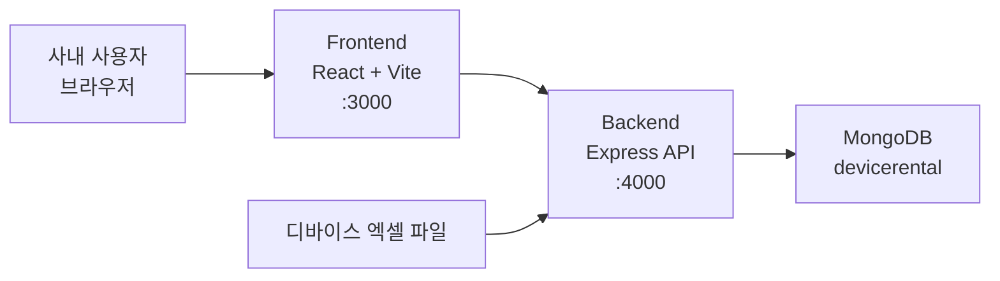
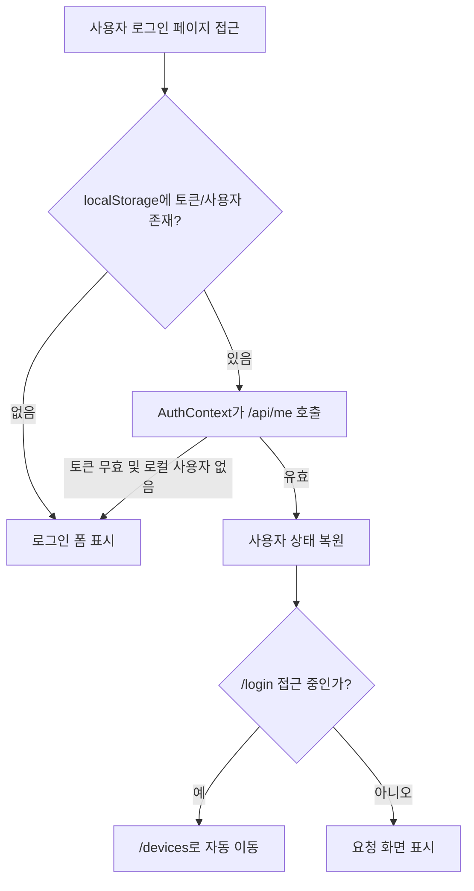
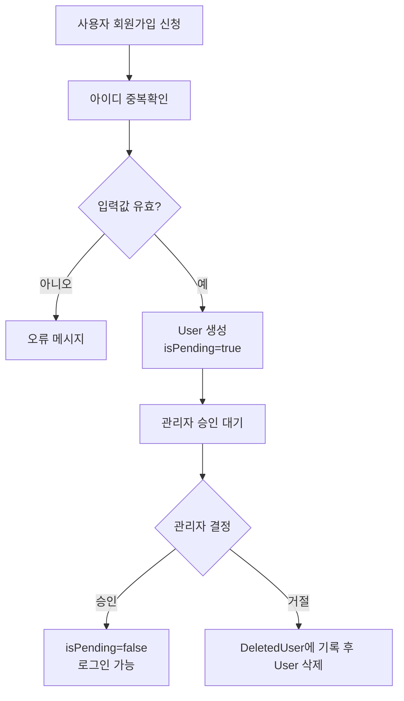
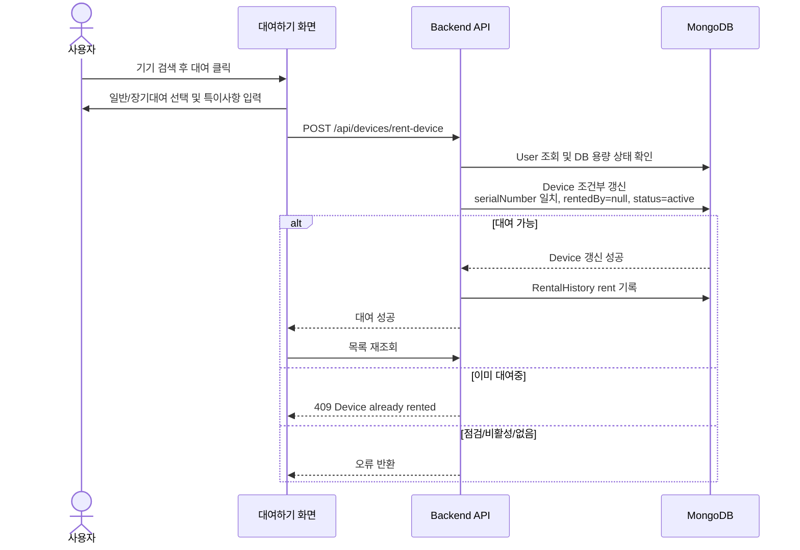
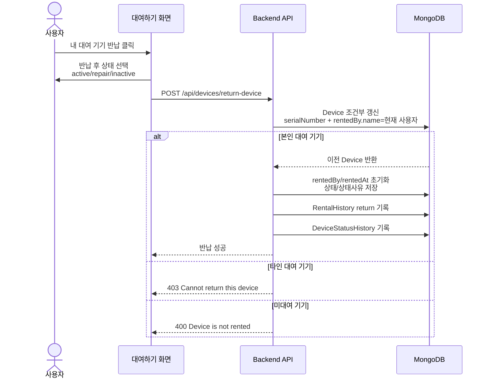
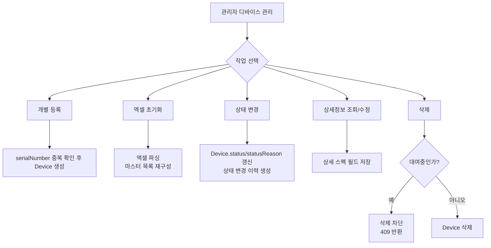

# DeviceRent 역기획서

작성일: 2026-06-16  
기준 소스: 현재 `main` 브랜치 작업본  
대상 독자: 팀장, 실장, 운영 관리자, 개발/QA 담당자

## 1. 문서 목적

본 문서는 현재 구현된 DeviceRent 시스템을 기준으로 서비스 목적, 사용자 권한, 핵심 업무 흐름, 데이터 구조, API, 운영 정책을 역기획 관점에서 정리한다. 신규 운영자 온보딩, 기능 검수, 배포 승인, 후속 개선 범위 산정에 활용할 수 있도록 비즈니스 로직 중심으로 작성한다.

## 2. 서비스 개요

DeviceRent는 사내 QA 조직의 모바일 디바이스 대여, 반납, 현황 조회, 장기대여 승인, 장비 관리, 대여 이력 보관을 지원하는 웹 기반 자산 운영 시스템이다.

핵심 목표는 다음과 같다.

- 디바이스별 현재 대여 가능 여부를 실시간에 가깝게 확인한다.
- 사용자는 본인이 필요한 기기를 검색하고 직접 대여/반납한다.
- 관리자는 전체 기기 목록, 상태, 상세 스펙, 엑셀 기반 마스터 데이터를 관리한다.
- 팀장 이상 권한자는 장기대여 신청을 승인 또는 거절한다.
- 대여/반납/상태 변경 이력을 보존하고 필요 시 엑셀로 내보낸다.

## 3. 사용자와 권한

| 구분 | 주요 권한 | 접근 화면 |
| --- | --- | --- |
| 미승인 사용자 | 회원가입 신청, 아이디 중복확인 | 회원가입, 로그인 |
| 일반 사용자 | 로그인, 기기 검색, 대여, 본인 대여 기기 반납, 대여 현황/히스토리 조회 | 대여하기, 대여 현황, 대여 히스토리 |
| 관리자 | 일반 사용자 권한 + 사용자 승인/삭제, 디바이스 등록/삭제/상태 변경/상세정보 수정, 엑셀 초기화, 이력 내보내기 | 관리자, 디바이스 관리, 사용자 관리, 대시보드 |
| 팀장 이상 | 장기대여 승인/거절 | 승인 대기 |

권한은 사용자 `position`, `roleLevel`, `isAdmin`으로 관리된다.

- 관리자 API는 `adminAuth` 미들웨어를 통해 `isAdmin=true` 사용자를 요구한다.
- 장기대여 승인 API는 `requireRoleLevel(3)`을 통해 팀장급 이상 사용자를 요구한다.
- 로그인 토큰은 JWT이며, 관리자 토큰은 365일, 일반 사용자 토큰은 1시간 유효하다.

## 4. 시스템 구성



Docker Compose 구성 기준:

- `frontend`: React/Vite 앱, 외부 `3000` 포트
- `backend`: Express API, 외부 `4000` 포트
- `mongo`: 내부 네트워크 전용, 외부 `27017` 미노출
- `mongo-data`: MongoDB 영속 볼륨

## 5. 주요 화면

| 화면 | 경로 | 주요 기능 |
| --- | --- | --- |
| 로그인 | `/login` | 로그인, 로그인 유지 사용자는 `/devices`로 자동 이동 |
| 회원가입 | `/register` | 이름, 소속, 아이디, 비밀번호, 직급 입력, 아이디 중복확인 |
| 대여하기 | `/devices` | 전체/대여가능/대여중/내대여 요약, 기기 검색, 대여/반납, 상세정보 조회 |
| 대여 현황 | `/devices/status` | 현재 대여 중 기기 목록, 요약 카드, 특이사항 조회 |
| 대여 히스토리 | `/devices/history` | 대여/반납 이력 조회 및 기간별 내보내기 |
| 관리자 홈 | `/admin` | 관리자 기능 진입, 보존기간 이력 정리 |
| 디바이스 관리 | `/devices/manage` | 기기 등록/삭제/상태 변경/상세정보 수정/엑셀 초기화 |
| 사용자 관리 | `/admin/users`, `/admin/pending` | 승인 사용자 조회, 가입 승인/거절, 사용자 삭제 |
| 대시보드 | `/dashboard` | 전체 보유, 대여중, 장기대여, 점검/비활성, 지연 대여 집계 |
| 장기대여 승인 | `/longterm/approvals` | 장기대여 신청 승인/거절 |

## 6. 핵심 업무 흐름

### 6.1 로그인 및 세션 유지



비즈니스 규칙:

- 로그인 성공 시 JWT를 저장하고 `/api/me`로 사용자 정보를 다시 조회한다.
- 앱 초기화 시 저장된 토큰이 있으면 `/api/me`로 유효성을 검증한다.
- 이미 로그인된 사용자가 `/login`에 접근하면 대여하기 페이지로 이동한다.
- 모바일 로그인 사용자는 `/mobile/rent`로 이동한다.

### 6.2 회원가입 및 승인



비즈니스 규칙:

- 가입 시 이름, 소속, 아이디, 비밀번호, 비밀번호 확인, 직급은 필수다.
- 아이디는 최소 3자, 비밀번호는 최소 6자다.
- 가입 직후 계정은 `isPending=true`이며 로그인할 수 없다.
- 관리자가 승인해야 정상 로그인 가능하다.
- 거절/삭제된 사용자는 `DeletedUser`에 삭제 사유와 함께 기록된다.

### 6.3 디바이스 대여



비즈니스 규칙:

- 대여는 `status=active`이고 `rentedBy=null`인 기기만 가능하다.
- 서버는 `findOneAndUpdate` 조건부 갱신으로 중복 대여를 차단한다.
- 대여 성공 시 `Device.rentedBy`, `rentedAt`, `remark`, `rentalType`, `longTermStatus`가 갱신된다.
- 일반 대여는 `rentalType=normal`, `longTermStatus=none`이다.
- 장기대여는 기기를 즉시 대여 처리하되 `rentalType=longterm`, `longTermStatus=pending`으로 승인 대기 상태가 된다.
- 대여 성공 시 `RentalHistory`에 `action=rent` 기록이 생성된다.

### 6.4 디바이스 반납



비즈니스 규칙:

- 사용자는 본인 이름으로 대여된 기기만 반납할 수 있다.
- 반납 시 기기 대여 정보는 초기화되고, 장기대여 상태도 일반 상태로 환원된다.
- 반납 후 상태는 `active`, `repair`, `inactive` 중 하나로 저장된다.
- 반납은 `RentalHistory`, 상태 변경은 `DeviceStatusHistory`에 각각 기록된다.

### 6.5 장기대여 승인

```mermaid
stateDiagram-v2
  [*] --> Available: active + rentedBy=null
  Available --> NormalRented: 일반 대여
  Available --> LongTermPending: 장기대여 신청
  LongTermPending --> LongTermApproved: 팀장 이상 승인
  LongTermPending --> NormalRented: 팀장 이상 거절
  NormalRented --> Available: 반납
  LongTermApproved --> Available: 반납

  state Available as "대여 가능"
  state NormalRented as "일반 대여중"
  state LongTermPending as "장기대여 승인 대기"
  state LongTermApproved as "승인된 장기대여"
```

비즈니스 규칙:

- 장기대여 신청자는 일반 사용자와 동일하게 기기를 대여하지만, 승인 전까지 `pending`이다.
- 팀장 이상은 승인 대기 목록에서 승인/거절할 수 있다.
- 승인 시 `longTermStatus=approved`, `approvedBy`, `approvedAt`이 저장된다.
- 거절 시 실제 대여는 유지하되 `rentalType=normal`, `longTermStatus=none`으로 환원된다.
- 대시보드의 72시간 초과 지연 집계는 승인된 장기대여를 제외한다.

### 6.6 디바이스 관리



비즈니스 규칙:

- 관리자는 기기를 개별 등록하거나 엑셀 파일로 초기화할 수 있다.
- 엑셀 초기화는 현재 운영 엑셀의 주요 시트에서 시리얼, 기기명, OS, 기기 상태, 상세 스펙을 읽는다.
- 엑셀의 기기 상태는 시스템 상태로 변환된다.
  - 사용 가능: `active`
  - 수리: `repair`
  - 폐기/대여 제외: `inactive`
- 상세정보에는 기기 상태, 구분, 제조사, 모델번호, 칩셋, CPU, GPU, 메모리, Bluetooth, 화면 크기, 해상도, 등록일, 확인일, UDID, 비고가 포함된다.
- 대여 중인 기기는 삭제할 수 없다. 백엔드에서 `rentedBy=null` 조건으로만 삭제하여 우회 요청도 차단한다.
- 관리 페이지 상세정보 모달은 조회 후 수정 버튼을 눌렀을 때만 편집 상태가 된다.
- 대여하기 페이지 상세정보 모달은 조회 전용이다.

## 7. 데이터 모델

### 7.1 Device

| 필드 | 의미 |
| --- | --- |
| `serialNumber` | 기기 고유 식별자 |
| `deviceInfo`, `modelName` | 표시용 기기명/모델명 |
| `osName`, `osVersion` | OS 계열 및 버전 |
| `rentedBy` | 현재 대여자 이름/소속, 미대여 시 `null` |
| `rentedAt` | 현재 대여 시작 시각 |
| `rentalType` | `normal` 또는 `longterm` |
| `longTermStatus` | `none`, `pending`, `approved` |
| `approvedBy`, `approvedAt` | 장기대여 승인자/승인시각 |
| `status` | `active`, `repair`, `inactive` |
| `statusReason` | 상태 변경 사유 |
| `remark` | 대여 특이사항 |
| `details` | 엑셀 기반 상세 스펙 |

### 7.2 User

| 필드 | 의미 |
| --- | --- |
| `id` | 로그인 아이디 |
| `password` | bcrypt 해시 비밀번호 |
| `name`, `affiliation` | 사용자 이름/소속 |
| `position` | 직급 |
| `roleLevel` | 권한 레벨, 낮을수록 상위 권한 |
| `isPending` | 관리자 승인 대기 여부 |
| `isAdmin` | 관리자 권한 여부 |

### 7.3 RentalHistory

| 필드 | 의미 |
| --- | --- |
| `deviceId`, `serialNumber` | 대상 기기 |
| `userId`, `userDetails` | 대여/반납 수행 사용자 |
| `action` | `rent` 또는 `return` |
| `timestamp` | 수행 시각 |
| `deviceInfo` | 당시 기기명/OS 정보 |
| `remark` | 대여 특이사항 |

### 7.4 DeviceStatusHistory

| 필드 | 의미 |
| --- | --- |
| `serialNumber` | 대상 기기 |
| `modelName`, `osName`, `osVersion` | 당시 기기 정보 |
| `status` | 변경된 상태 |
| `statusReason` | 상태 변경 사유 |
| `performedBy` | 수행자 |
| `timestamp` | 수행 시각 |

## 8. 주요 API

| 구분 | Method/Path | 용도 | 권한 |
| --- | --- | --- | --- |
| 인증 | `POST /api/auth/register` | 회원가입 신청 | 공개 |
| 인증 | `POST /api/auth/check-id` | 아이디 중복확인 | 공개 |
| 인증 | `POST /api/auth/login` | 로그인 및 JWT 발급 | 공개 |
| 인증 | `GET /api/me` | 현재 사용자 검증 | 로그인 |
| 기기 | `GET /api/devices` | 전체 기기 목록 | 로그인 |
| 기기 | `GET /api/devices/available` | 대여 가능 기기 목록 | 로그인 |
| 기기 | `GET /api/devices/status` | 현재 대여 중 기기 목록 | 로그인 |
| 대여 | `POST /api/devices/rent-device` | 기기 대여 | 로그인 |
| 반납 | `POST /api/devices/return-device` | 기기 반납 | 로그인 |
| 이력 | `GET /api/devices/history` | 대여/반납 이력 조회 | 로그인 |
| 이력 | `POST /api/devices/history/export` | 이력 엑셀 내보내기 | 로그인 |
| 관리자 | `POST /api/admin/upload-devices` | 엑셀 기반 기기 초기화 | 관리자 |
| 관리자 | `POST /api/devices/manage/register` | 기기 개별 등록 | 관리자 |
| 관리자 | `POST /api/devices/manage/delete` | 기기 삭제 | 관리자 |
| 관리자 | `POST /api/devices/manage/update-details` | 상세정보 수정 | 관리자 |
| 관리자 | `POST /api/devices/manage/update-status` | 기기 상태 변경 | 로그인 토큰, 화면상 관리자 |
| 관리자 | `GET /api/admin/users/pending` | 가입 승인 대기 조회 | 관리자 |
| 관리자 | `POST /api/admin/users/approve` | 사용자 승인 | 관리자 |
| 관리자 | `POST /api/admin/users/reject` | 사용자 거절 | 관리자 |
| 관리자 | `POST /api/admin/users/delete` | 사용자 삭제 | 관리자 |
| 대시보드 | `GET /api/devices/dashboard` | 운영 지표 조회 | 관리자 |
| 장기대여 | `GET /api/devices/longterm/pending` | 장기대여 승인 대기 조회 | 팀장 이상 |
| 장기대여 | `POST /api/devices/longterm/approve` | 장기대여 승인 | 팀장 이상 |
| 장기대여 | `POST /api/devices/longterm/reject` | 장기대여 거절 | 팀장 이상 |

## 9. 운영 지표 정의

| 지표 | 정의 |
| --- | --- |
| 전체 | 전체 Device 수 |
| 대여 가능 | `status=active`이고 `rentedBy=null`인 기기 |
| 대여중 | `rentedBy`가 존재하는 기기 |
| 내 대여 | 로그인 사용자의 이름과 `rentedBy.name`이 일치하는 기기 |
| 점검/비활성 | `status=repair` 또는 `status=inactive`인 기기 |
| 장기대여 승인 | `rentalType=longterm`, `longTermStatus=approved` |
| 장기대여 승인 대기 | `rentalType=longterm`, `longTermStatus=pending` |
| 지연 대여 | 대여 후 72시간 이상이며 승인된 장기대여가 아닌 건 |

## 10. 예외 및 통제 정책

| 상황 | 처리 |
| --- | --- |
| 토큰 없음 | 401 반환, 프론트는 로그인으로 이동 |
| 토큰 무효 | 401 또는 403 반환 |
| 미승인 사용자 로그인 | 403, 승인 대기 메시지 |
| 이미 대여된 기기 대여 | 409 반환 |
| 점검/비활성 기기 대여 | 400 반환 |
| 타인 대여 기기 반납 | 403 반환 |
| 대여 중 기기 삭제 | 409 반환, 삭제 차단 |
| DB 용량 95% 초과 | 대여/반납 작업 503 차단 |
| 엑셀 파일 없음 | 400 반환 |
| 상세정보 수정 대상 없음 | 404 반환 |

## 11. 빌드 및 검증 결과

2026-06-16 현재 소스 기준으로 아래 검증을 수행했다.

| 항목 | 결과 |
| --- | --- |
| Frontend Vite production build | 성공 |
| Backend 문법 검증 | 성공 |
| Backend 관리/삭제 회귀 테스트 | 성공, 7개 테스트 통과 |
| Docker Compose image build | 성공, `frontend`/`backend` 이미지 빌드 완료 |

프론트 빌드 명령:

```powershell
npm.cmd run build
```

백엔드 검증 명령:

```powershell
node --check server.js
node --check routes/devices.js
node --check routes/auth.js
node --check routes/admin/users.js
$env:JWT_SECRET='device-rental-test-secret-that-is-long-enough'
npx.cmd jest tests/routes/devices/devices-other.test.js --runInBand --coverage=false
```

Docker 이미지 빌드 명령:

```powershell
docker compose build frontend backend
```

## 12. 현행 구현상 유의점

- 대여 가능 여부는 서버의 조건부 갱신으로 최종 판정되므로, 여러 사용자가 동시에 같은 기기를 대여하려 해도 중복 대여는 차단된다.
- 대여 현황 페이지는 대여 중 목록을 표시하되, 요약 카드는 전체 기기 목록을 함께 조회해 계산한다.
- 엑셀 초기화 기능은 운영 마스터 데이터를 시스템 기준 데이터로 재구성하는 기능이므로, 적용 전 파일 검수가 필요하다.
- MongoDB는 Compose 기준 외부 포트를 열지 않아 내부 서비스 간 통신만 허용한다.
- `frontend/dist`, `coverage`, `html-report`, `allure-report` 등 빌드/테스트 산출물은 운영 코드 커밋 대상에서 제외하는 것이 바람직하다.
